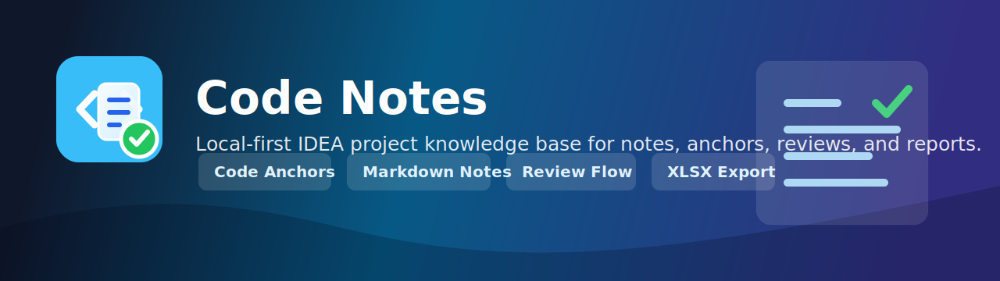

# Code Notes - IntelliJ IDEA Plugin

A local-first project knowledge base attached directly to your source code:
project notes, file/line notes, Java/Kotlin symbol notes, TODO workflows,
gutter icons, Markdown preview, attachments, backup/restore, code review
reports, and a bilingual (English / 简体中文) UI.

## What's implemented

- **Add Code Note...** - right-click any line or selection in the editor, or use `Alt+M`.
- **Create Note from Clipboard** - `Ctrl+Alt+V` saves clipboard text as a note linked to the current line.
- **Mark as Code Review Issue** - `Ctrl+Alt+R` creates a linked note and adds it to the latest code review.
- Note types: Comment, Bug, Question, Optimization, Review, Warning, Important, Architecture, Temporary, Permanent, TODO, Decision.
- Fields per note: title, summary, Markdown description, tags, favorite flag, priority, status, and due date.
- **Line/selection anchors** use normalized content hashes and can relocate multi-line anchors when code shifts or indentation changes.
- **Java/Kotlin symbol anchors** record symbol metadata for recognizable classes, fields/properties, methods, and functions, with line/hash fallback.
- **Gutter icons** show notes on annotated lines and refresh after note changes.
- **Three-pane tool window** with filters, search, list navigation, Markdown editor/preview, task status fields, and jump-to-code navigation.
- **Code review workspace** tracks review meetings, linked note issues, independent issues, required export fields, and jump-to-code navigation.
- **Code review reports** export XLSX meeting reports from the bundled template, with an optional custom template override in settings.
- **Attachments** are copied into `.idea/codeNotesAttachments` and can be opened or removed from the note.
- **Backup/restore** exports and imports project notes as XML with relative paths.
- **Persistence** stores notes in `<project>/.idea/codeNotes.xml`; no database or network service is required.
- **Settings > Tools > Code Notes** switches UI language between Follow IDE, English, and Simplified Chinese.
- **Visual assets** include JetBrains plugin icons, custom tool window/action/gutter icons, and the README banner.

## Compatibility

`since-build="231"` (2023.1) with no `until-build`, so the built plugin is not pinned to a specific IDE version. It depends on `com.intellij.modules.platform`.

## Build it

Use JDK 17+:

```bash
cd codenotes-plugin
./gradlew buildPlugin
```

On Windows:

```powershell
cd codenotes-plugin
.\gradlew.bat buildPlugin
```

The installable plugin zip is written to `build/distributions/`.

For manual testing:

```bash
./gradlew runIde
```

## Project layout

```text
src/main/kotlin/com/codenotes/plugin/
  actions/      Editor actions, clipboard note creation, review issue creation
  anchor/       SymbolAnchorService for Java/Kotlin-style PSI anchors
  attachments/  AttachmentService for project-local files
  events/       Note and code review change buses for real-time refresh
  io/           NoteBackupService XML import/export
  model/        Notes, anchors, attachments, folders, reviews, issues, task status
  repository/   NoteRepository and CodeReviewRepository mutation/query facades
  review/       Review issue mapping, export validation, XLSX export service
  settings/     CodeNotesSettingsState and CodeNotesConfigurable
  state/        NoteStorageService PersistentStateComponent
  toolwindow/   Notes and code review workspaces
  ui/           Editor and export dialogs
  util/         AnchorUtil, MarkdownPreview, CodeNotesBundle, CodeNotesIcons
src/main/resources/
  icons/        SVG icons for tool window, actions, and gutter markers
  META-INF/     plugin.xml and JetBrains pluginIcon.svg assets
  templates/    Bundled code review XLSX template
docs/images/    README banner artwork
```

## Notes

The enhanced version remains local-first by design. Evernote/cloud sync,
AI-assisted note generation, SQLite storage, TypeScript/PHP/C# symbol anchors,
and knowledge graph views are intentionally left for later phases.
